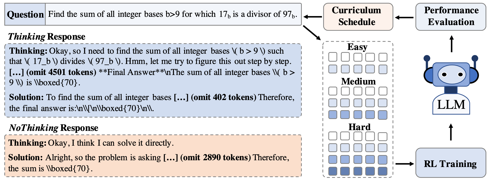

<div align='center'>
<h2>TACLer: Tailored Curriculum Reinforcement Learning for Efficient Reasoning</h2>

[](https://arxiv.org/pdf/2601.21711)
[](https://huggingface.co/laihuiyuan/TACLer)
</div>

## Overview

<p align='center'>

</p>

We release **TACLer-1.5B** ([🤗 HF Model](https://huggingface.co/laihuiyuan/TACLer)), a hybrid reasoning model that supports both *Thinking* and *NoThinking* mode! 
We propose a model-tailored curriculum reinforcement learning framework that gradually increases the complexity of the data based on the model's proficiency in multi-stage RL training.

Our experiments show that: 
(i) TACLer reduces computational cost, **cutting training compute by over 50%** compared to long thinking models and **reducing inference token usage by over 42%** relative to the base model (*DeepSeek-R1-Distill-Qwen-1.5B (R1-Qwen)*); 
and (ii) TACLer **improves accuracy by over 9%** on the base model, consistently outperforming  state-of-the-art *Nothinking* and *Thinking* baselines across four math datasets (MATH500, AMC, AIME 2024, and AIME 2025).


## Evaluation

We sample 16 responses for each question in AMC, AIME 2024 and AIME 2025 (1 for MATH500), and report the average results (Accuracy and token usage) due to their limited dataset size.

```bash
cd evaluation
sh run_eval.sh laihuiyuan/TACLer
```

#### *Thinking* mode
<table>
  <tr style="text-align:center;">
    <td colspan="1">Models</td> 
    <td colspan="2" style="text-align:center;">MATH500</td>
    <td colspan="2" style="text-align:center;">AIME2024</td>
    <td colspan="2" style="text-align:center;">AMC</td> 
    <td colspan="2" style="text-align:center;">AIME 2025</td> 
    <td colspan="2" style="text-align:center;">Average</td>
  </tr>
  <tr style="text-align:center;">
    <td>Metrics</td> 
    <td>ACC</td> <td>Length</td> <td>ACC</td> <td>Length</td> <td>ACC</td> <td>Length</td> <td>ACC</td> <td>Length</td> <td>ΔACC</td> <td>ΔLength</td>
  </tr>
  <tr style="text-align:center;">
    <td>R1-Qwen_Thinking</td>         <td>81.2</td> <td>4856</td> <td>27.7</td> <td>12306</td> <td>60.8</td> <td>8754</td> <td>21.5</td> <td>12182</td> <td>-</td> <td>-</td>
  </tr>
  <tr style="text-align:center;">
    <td>STILL-3</td>         <td>83.6</td> <td>3797</td> <td>30.4</td> <td>10605</td> <td>66.3</td> <td>7091</td> <td>24.4</td> <td>10415</td> <td>+3.4</td> <td>-17.3%</td>
  </tr>
  <tr style="text-align:center;">
    <td>DeepScaleR</td>      <td>87.8</td> <td>3030</td> <td>40.4</td> <td>8565</td>  <td>73.8</td> <td>5616</td> <td>31.3</td> <td>8239</td>  <td>+10.5</td> <td>-34.1%</td>
  </tr>
  <tr style="text-align:center;">
    <td>FastCuRL</td>        <td>87.8</td> <td>3894</td> <td>39.8</td> <td>10091</td> <td>73.9</td> <td>6756</td> <td>27.9</td> <td>9723</td>  <td>+9.6</td> <td>-20.2%</td>
  </tr>
  <tr style="text-align:center;">
    <td>TACLer_Thinking</td> <td>88.4</td> <td>3010</td> <td>42.1</td> <td>6868</td> <td>74.6</td> <td>4871</td> <td>30.8</td> <td>68.7</td>  <td>+11.2</td> <td>-42.7%</td>
  </tr>
</table>


#### *NoThinking* mode
For MATH500 and AIME 2024, results for all baselines except AutoThink are taken from [Zhang et al. (2025)](https://arxiv.org/abs/2505.13417). 
<table>
  <tr style="text-align:center;">
    <td colspan="1">Models</td> 
    <td colspan="2" style="text-align:center;">MATH500</td>
    <td colspan="2" style="text-align:center;">AIME2024</td>
    <td colspan="2" style="text-align:center;">Average</td>
  </tr>
  <tr style="text-align:center;">
    <td>Metrics</td> <td>ACC</td> <td>Length</td> <td>ACC</td> <td>Length</td> <td>ΔACC</td> <td>ΔLength</td>
  </tr>
  <tr style="text-align:center;">
    <td>R1-Qwen_Thinking</td>   <td>81.2</td> <td>4856</td> <td>27.7</td> <td>12306</td> <td>-</td> <td>-</td>
  </tr>
  <tr style="text-align:center;">
    <td>R1-Qwen_NoThinking</td> <td>67.8</td> <td>1069</td> <td>14.8</td> <td>4689</td> <td>-13.2</td> <td>69.9</td>
  </tr>
  <tr style="text-align:center;">
    <td>OverThink</td> <td>81.2</td> <td>4131</td> <td>28.3</td> <td>11269</td> <td>+0.3</td> <td>-11.7</td>
  </tr>
  <tr style="text-align:center;">
    <td>DAST</td>      <td>83.0</td> <td>2428</td> <td>26.9</td> <td>7745</td> <td>+0.5</td> <td>-43.5</td>
  </tr>
  <tr style="text-align:center;">
    <td>O1-Pruner</td> <td>82.2</td> <td>3212</td> <td>28.9</td> <td>10361</td> <td>+1.1</td> <td>-24.8</td>
  </tr>
  <tr style="text-align:center;">
    <td>TLMRE</td>     <td>85.0</td> <td>3007</td> <td>29.2</td> <td>8982</td> <td>+2.6</td> <td>-32.5</td>
  </tr>
  <tr style="text-align:center;">
    <td>ModelMergeing</td> <td>63.0</td> <td>2723</td> <td>18.1</td> <td>10337</td> <td>-13.9</td> <td>-30.0</td>
  </tr>
  <tr style="text-align:center;">
    <td>AdapThink</td> <td>86.0</td> <td>2511</td> <td>34.8</td> <td>9279</td> <td>+5.9</td> <td>-36.4</td>
  </tr>
  <tr style="text-align:center;">
    <td>AutoThink</td> <td>83.8</td> <td>2128</td> <td>31.7</td> <td>8167</td> <td>+3.3</td> <td>-44.9</td>
  </tr>
  <tr style="text-align:center;">
    <td>TACLer_NoThinking</td> <td>88.2</td> <td>2531</td> <td>39.6</td> <td>6056</td> <td>+9.5</td> <td>-49.3</td>
  </tr>
  
  <tr style="text-align:center;">
    <td colspan="1">Models</td> 
    <td colspan="2" style="text-align:center;">AMC</td> 
    <td colspan="2" style="text-align:center;">AIME 2025</td> 
    <td colspan="2" style="text-align:center;">Average</td>
  </tr>
  <tr style="text-align:center;">
    <td>R1-Qwen_Thinking</td> <td>60.8</td> <td>8754</td> <td>21.5</td> <td>12182</td> <td>-</td> <td>-</td>
  </tr>
  <tr style="text-align:center;">
    <td>R1-Qwen_Thinking</td> <td>48.6</td> <td>2264</td> <td>13.3</td> <td>4062</td> <td>--10.2</td> <td>-70.4%</td>
  </tr>
  <tr style="text-align:center;">
    <td>AdaptThink</td> <td>67.4</td> <td>5489</td> <td>25.6</td> <td>9117</td> <td>+5.4</td> <td>-32.2</td>
  </tr>
  <tr style="text-align:center;">
    <td>AutoThink</td> <td>66.7</td> <td>4596</td> <td>23.8</td> <td>7647</td> <td>+4.1</td> <td>-42.4</td>
  </tr>
  <tr style="text-align:center;">
    <td>TACLer_NoThinking</td> <td>72.7</td> <td>4312</td> <td>27.9</td> <td>5710</td> <td>+9.2</td> <td>-51.9</td>
  </tr>
</table>


## Citation
```
@article{lai-etal-2026-tacler,
    title = "TACLer: Tailored Curriculum Reinforcement Learning for Efficient Reasoning",
    author = "Lai, Huiyuan and Nissim, Malvina",
    journal={arXiv preprint arXiv:2601.21711},
    year={2026},
    url={https://arxiv.org/pdf/2601.21711}
}
```